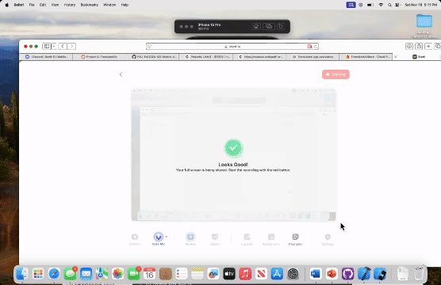

# TranslationMe - Real-Time Language Translation App

**TranslationMe** is an innovative app that enables users to easily translate text and speech between multiple languages. The app provides an intuitive interface where users can input text, select source and target languages, and instantly view translation results. Additionally, the app supports voice output with a "read aloud" button for better accessibility. It also stores translation history, allowing users to manage past translations and clear the history when needed.

- **Developer:** Noah Russell
- **Development Time:** 5 hours
- **Technologies Used:** Swift, Firestore, AVFoundation, Xcode

## Features

The following required features have been successfully implemented:

- [✅] **Translation Interface**: Users can enter a word, phrase, or sentence, select source and target languages, and translate it with the tap of a button.
- [✅] **Real-Time Translation**: After tapping the "Translate" button, the text entered in the upper field is translated into the lower field.
- [✅] **Translation History**: The app saves translation history and displays a list of past translations.
- [✅] **Clear History**: Users can erase the entire translation history with a confirmation prompt.

The following optional features have been implemented:

- [✅] **Language Variety**: Users can choose from 8 different languages for translation.
- [✅] **UI Flair**: The app has a clean and modern design, with smooth transitions and visual enhancements.

The following additional features have been implemented:

- [✅] **Error Handling**: Translation failures and issues with retrieving history are managed gracefully with error messages.
- [✅] **AV Speech**: Users can listen to the translated text using a "read aloud" button to improve accessibility.
- [✅] **Persistent Storage**: Translations are stored in Firestore and displayed with timestamps in the history list.
- [✅] **Clear All Translations**: Users can clear all translations with a confirmation prompt to ensure a clean slate.

## Future Enhancements

Potential future features include:

- [🔲] **Multi-Sentence Translation**: Expand the translation feature to handle multiple sentences rather than just a single word or phrase at a time.
- [🔲] **Offline Mode**: Implement offline translation capabilities by storing translations locally.

## Setup Instructions

To run the **TranslationMe** app locally, follow these steps:

1. **Clone the Repository**:
    - `git clone https://github.com/your-username/TranslationMe.git`
    - `cd TranslationMe`
2. **Open in Xcode**:
    - Open the `.xcodeproj` or `.xcworkspace` file in Xcode.
3. **Install Dependencies**:
    - If using CocoaPods or Swift Package Manager, install the required libraries (if any).
4. **Build and Run**:
    - Select the desired simulator or physical iOS device.
    - Click the "Run" button to build and launch the app.
5. **Test**:
    - Enter text, select languages, and test the translation functionality.
    - Use the "Read Aloud" button and manage your translation history.

## Video Walkthrough

Here’s a quick demonstration of the app’s core features:

  
GIF created with VEED.io.

## Development Process

The app was developed using Swift and integrated with Firestore for persistent storage. The AVFoundation framework was used to add voice capabilities, enabling the "read aloud" feature for translated text. Firestore was utilized for storing translation history, and error handling was implemented to ensure smooth functionality. 

## Challenges Faced

- **Translation Handling**: Initially, there were challenges in ensuring the app could translate entire sentences and handle dynamic text.
- **Firestore Integration**: Setting up Firestore for persistent data storage and managing history retrieval was tricky, especially with real-time updates.
- **UI Responsiveness**: Maintaining UI responsiveness during translation requests required proper loading state management.
- **Voice Integration**: Incorporating voice synthesis for the "read aloud" feature added an extra layer of complexity in terms of both UI and accessibility.

## Key Takeaways

- Gained experience with integrating Firestore for persistent data storage.
- Developed accessibility features like AV speech synthesis to make the app more inclusive.
- Overcame challenges in managing dynamic language translations, error handling, and UI responsiveness.

## Technologies Used

- **Programming Language**: Swift
- **Frameworks**: Firestore, AVFoundation
- **Development Environment**: Xcode 14.0+
- **Version Control**: Git, GitHub

## License

**TranslationMe** is licensed under the Apache License 2.0.  
You may obtain a copy of the license at:  
[Apache License 2.0](http://www.apache.org/licenses/LICENSE-2.0)
